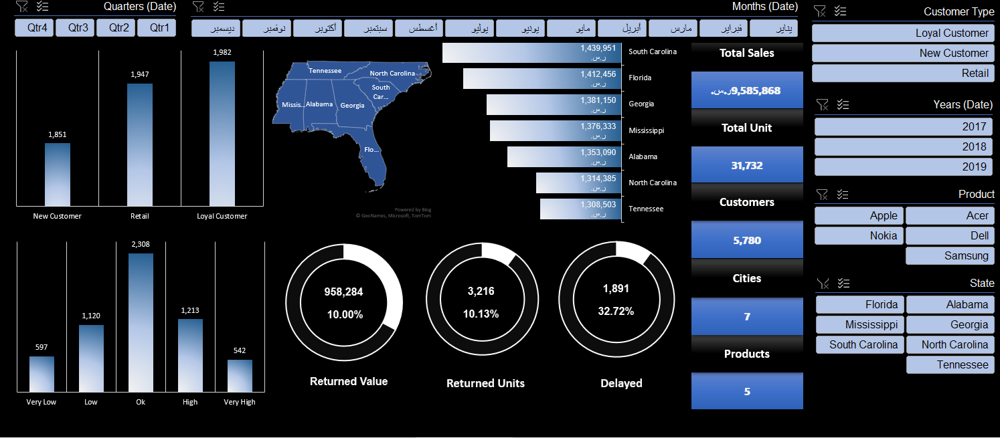

# Interactive Excel Sales Dashboard

Interactive Excel reporting project designed to monitor sales KPIs and explore customer, product, time, return, delivery, and geographic performance.

## Project Overview

This dashboard combines KPI monitoring with drill-down analysis to create a practical business-reporting experience directly in Excel.

## KPIs & Analysis

- Total sales
- Total units sold
- Distinct customers
- Number of cities and products
- Customer-type breakdown
- Year, quarter, and month analysis
- Product and state filtering
- Returned sales and returned units
- Delayed-order monitoring
- U.S. state sales map

## Tools & Skills

**Microsoft Excel** · **PivotTables** · **Slicers** · **Charts** · **Map Visualization** · **Conditional Formatting** · **KPI Dashboard Design**

## Repository Files

- `interactive-sales-dashboard-excel.xlsx` — interactive dashboard and supporting data
- `Screenshot.png.png` — dashboard preview

## How to Explore

Download the workbook, open it in Microsoft Excel, and use the available slicers and dashboard controls to explore the analysis.

## Portfolio Note

This project uses sample data for portfolio and learning purposes and demonstrates interactive Excel reporting and dashboard development.

## Author

**Raneem Alzahrani**  
[LinkedIn](https://www.linkedin.com/in/raneem-alzhrani-/) · [Portfolio](https://sites.google.com/view/raneemalzahrany/home) · [GitHub](https://github.com/Raneem6)